# Simulação de um Aplicativo de Controle Remoto para uma Cafeteira Smart
  
  Esse software foi desenvolvido com o intuito de criar um software que simula um controle remote para uma cafeteira smart, na qual você poderia fazer café através desse software sem precisar ir até a cafeteira, além dele ser capaz de armazenar os dados sobre cada ingrediente, se é possível ou não fazer determinado café, e se não é possível, ele indica quais ingredientes estão faltando. Para o desenvolvimento deste software foi utilizado a linguagem JAVA para poder aplicar os conceitos de orientação à objetos que foram aprendidos durante o semestre, como também o conceito de MVC, e os dados utilizados na aplicação estão todos armazenados em um arquivo de texto.

## Tela de Loading

  Assim que o software é iniciado, nós temos uma tela de loading:

  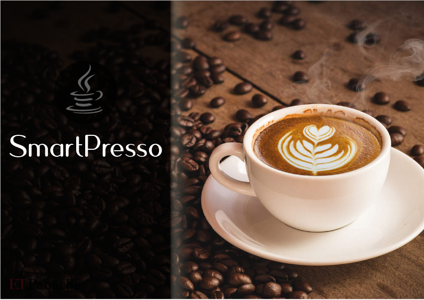

## Tela Principal

  Após, é carregado a tela principal, onde será realizado todos os processos de criação de café e gerenciamento dos ingredientes, sendo que essa tela foi dividida entre 4 abas: Menu, Ingredientes, Configurações e Sobre. 
  

  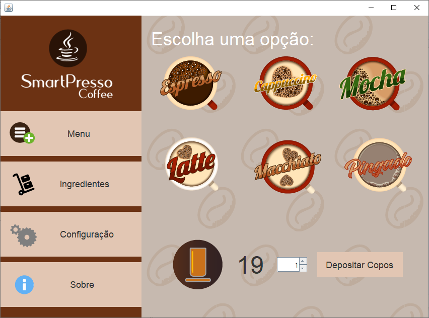

### Aba Menu

  Logo que a tela principal é carregada, o usuário se encontra na aba Menu, que é a aba responsável por criar os cafés apenas com um clique do botão no tipo de café desejado, além de indicar quantos copos disponíveis ainda tem para fazer café. Caso você não saiba quanto que é utilizado para a criação de cada café, ao passar o mouse por cima dos botões, aparece a quantidade utilizada de cada ingrediente para fazer o café, como podemos ver nos exemplos abaixo dos ingredientes usados para fazer um Expresso ou um Mocha:

  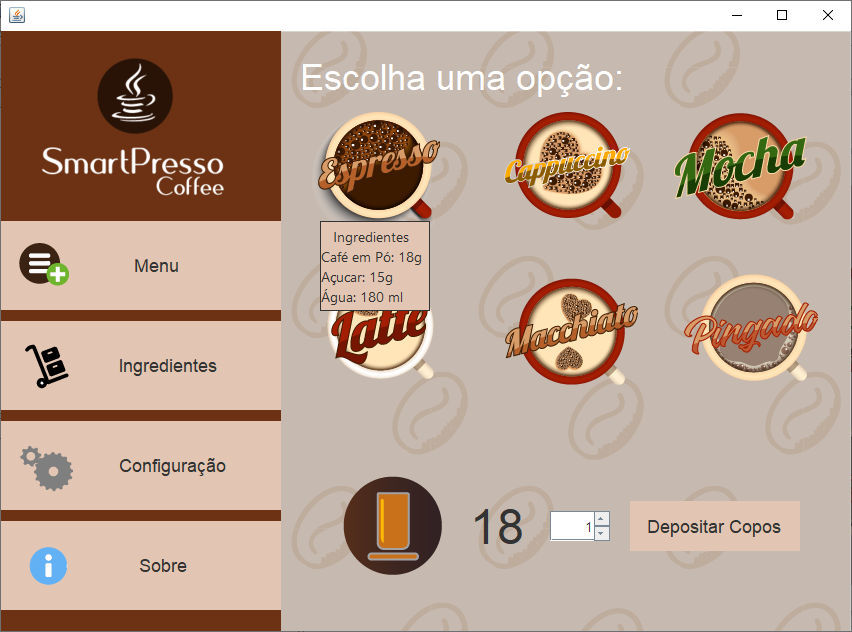

  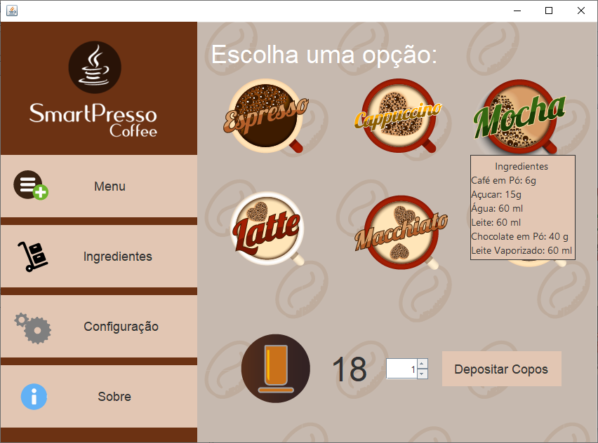

### Aba Ingredientes

  A aba ingredientes tem a responsabilidade de mostrar a quantidade de cada ingrediente, por meio das barrinhas que estão relacionadas a cada um deles, assim, quando a barra está cheia, isso significa que o reservatório daquele ingrediente está completo, assim como se estiver vazia, o reservatório estará vazio.
  

  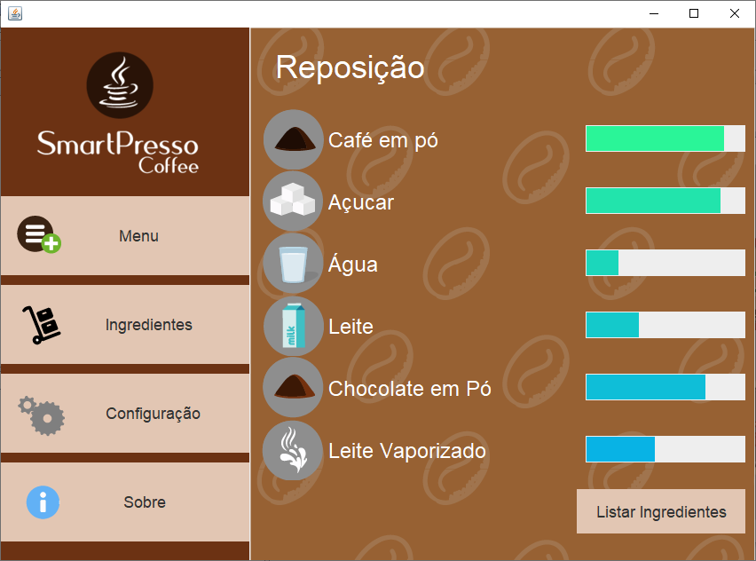

### Aba Configurações

  A aba de configurações serve apenas para mostrar se o software está conectado a cafeteira, porém é possível mudar seus valores, já que estamos falando de uma simulação.

  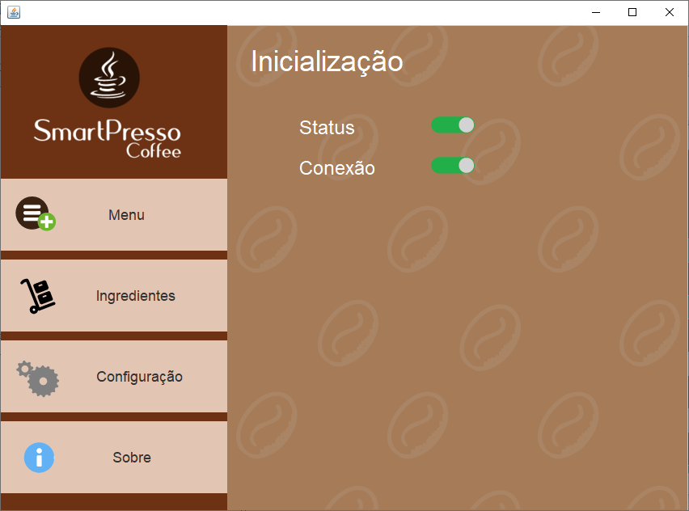

### Aba Sobre
  E por fim nós temos a aba sobre, que foi utilizada para indicar os desenvolvedores do projeto, e as funções que cada um teve no desenvolvimento da aplicação.
  

  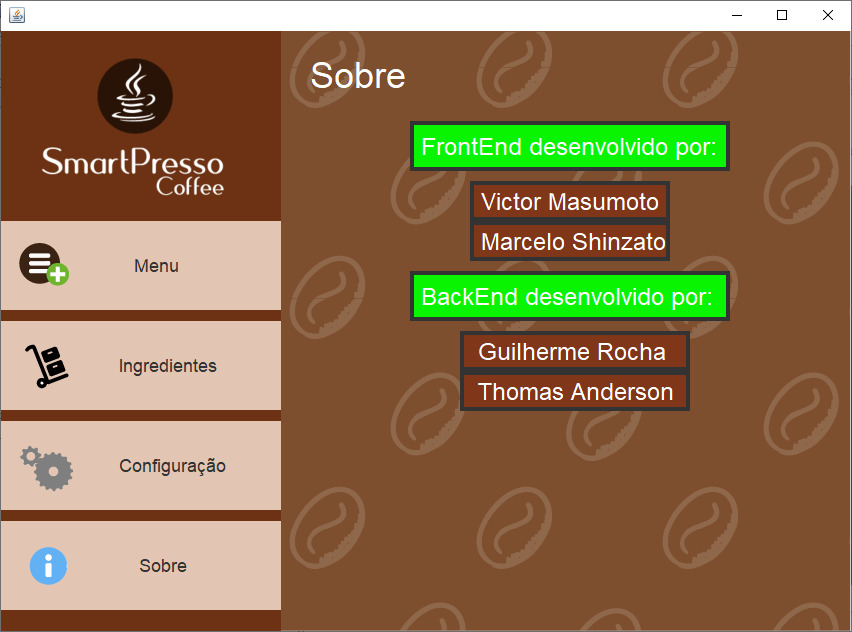

### Processo de Criação do Café

  Para fazer um café basta clicar em um dos botões correspondente ao tipo de café que você deseja fazer, no entanto, o café somente será feito se tiver pelo menos 1 copo, e os ingredientes forem suficientes, caso você cumpra os requisitos necessários, a mensagem abaixo será apresentada:
 

  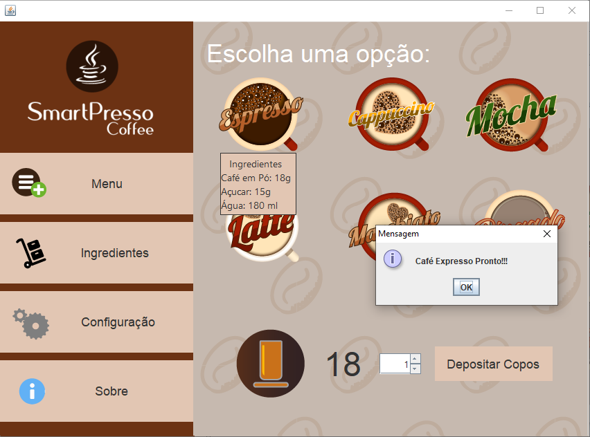

  Caso contrário, a aplicação indica que não foi possível produzir o café:

  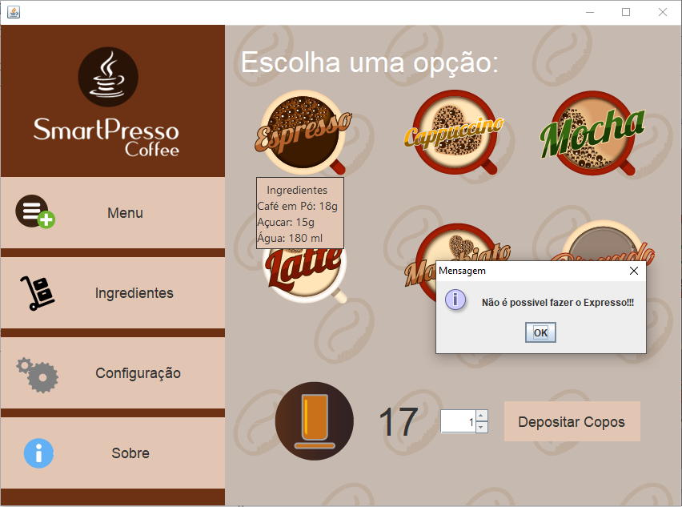

  E avisa sobre os ingredientes que estão faltando para produzir o café desejado:

  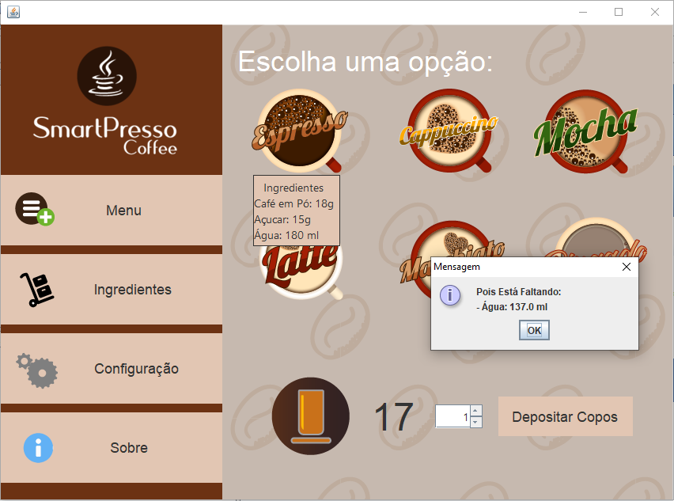

  E caso não tenha copos, ele também apresenta uma mensagem de erro:

  

  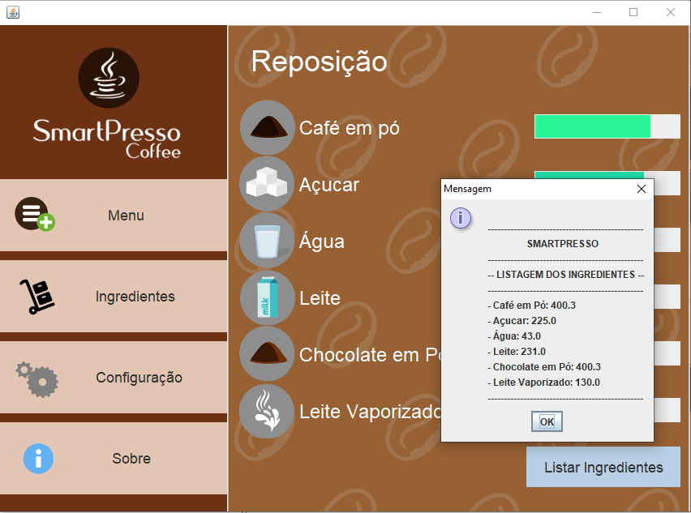

  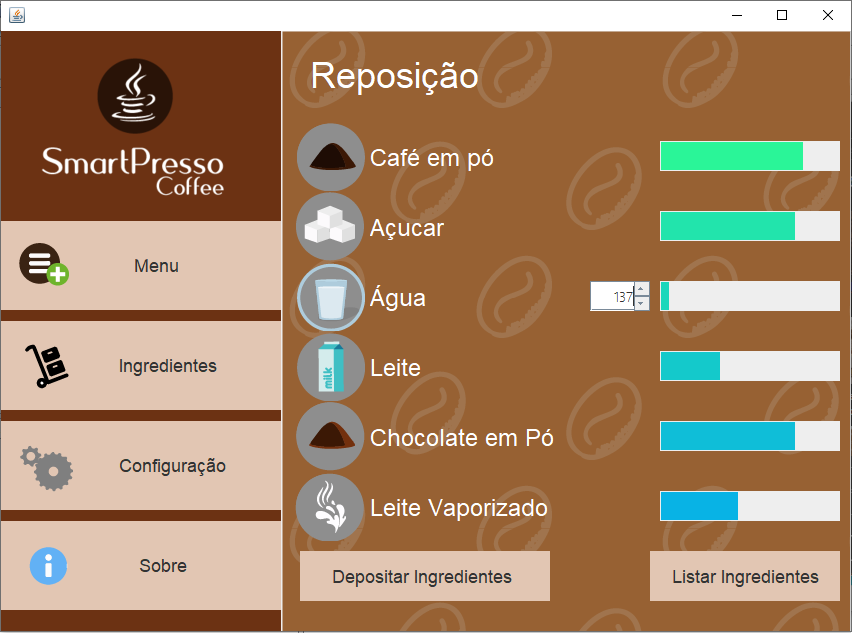

  

  

  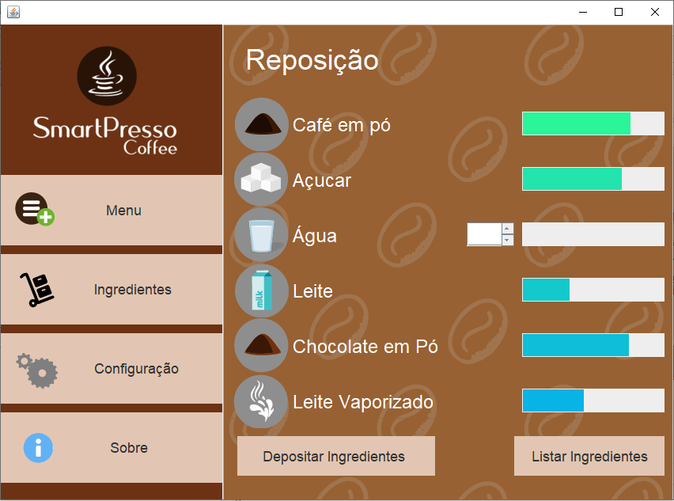

  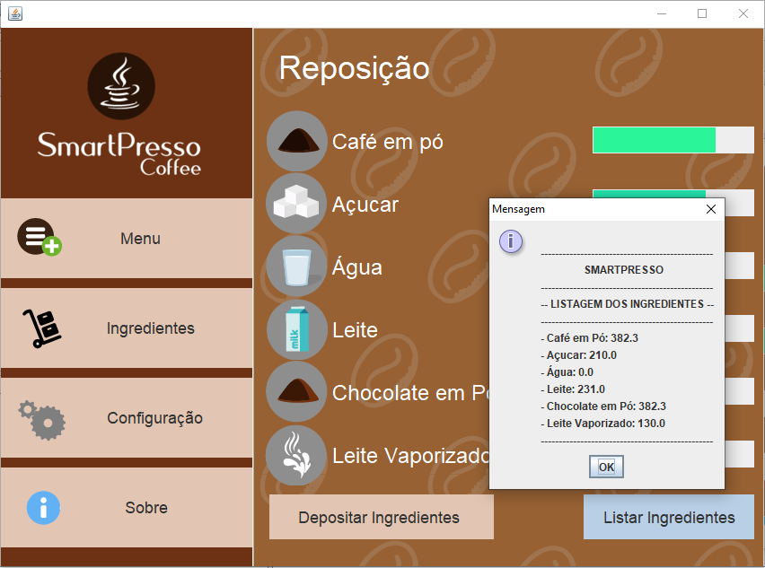

  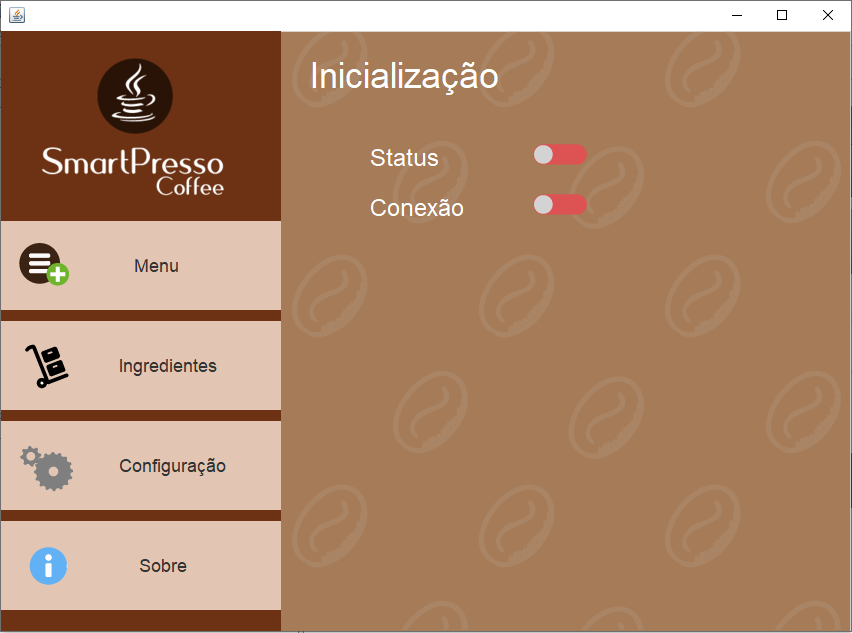

  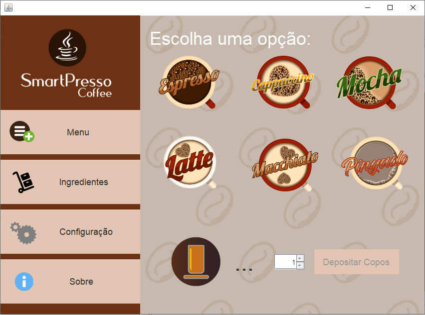

  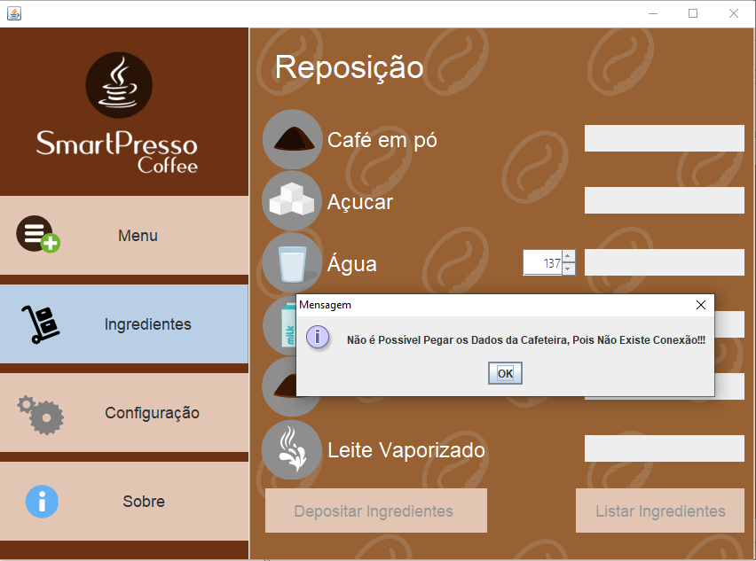

