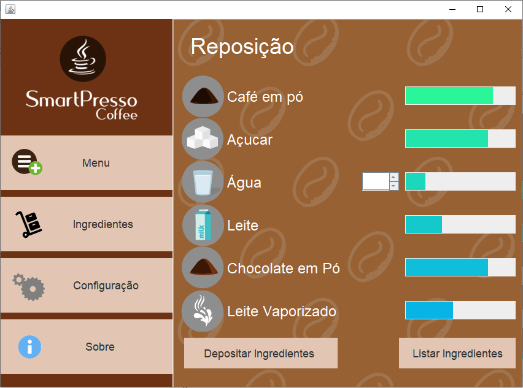

# Simulação de um Aplicativo de Controle Remoto para uma Cafeteira Smart
  
  Esse software foi desenvolvido com o intuito de criar um software que simula um controle remote para uma cafeteira smart, na qual você poderia fazer café através desse software sem precisar ir até a cafeteira, além dele ser capaz de armazenar os dados sobre cada ingrediente, se é possível ou não fazer determinado café, e se não é possível, ele indica quais ingredientes estão faltando. Para o desenvolvimento deste software foi utilizado a linguagem JAVA para poder aplicar os conceitos de orientação à objetos que foram aprendidos durante o semestre, como também o conceito de MVC, e os dados utilizados na aplicação estão todos armazenados em um arquivo de texto.

## Tela de Loading

  Assim que o software é iniciado, nós temos uma tela de loading:

  

## Tela Principal

  Após, é carregado a tela principal, onde será realizado todos os processos de criação de café e gerenciamento dos ingredientes, sendo que essa tela foi dividida entre 4 abas: Menu, Ingredientes, Configurações e Sobre. 
  

  

### Aba Menu

  Logo que a tela principal é carregada, o usuário se encontra na aba Menu, que é a aba responsável por criar os cafés apenas com um clique do botão no tipo de café desejado, além de indicar quantos copos disponíveis ainda tem para fazer café. Caso você não saiba quanto que é utilizado para a criação de cada café, ao passar o mouse por cima dos botões, aparece a quantidade utilizada de cada ingrediente para fazer o café, como podemos ver nos exemplos abaixo dos ingredientes usados para fazer um Expresso ou um Mocha:

  

  

### Aba Ingredientes

  A aba ingredientes tem a responsabilidade de mostrar a quantidade de cada ingrediente, por meio das barrinhas que estão relacionadas a cada um deles, assim, quando a barra está cheia, isso significa que o reservatório daquele ingrediente está completo, assim como se estiver vazia, o reservatório estará vazio.
  

  

### Aba Configurações

  A aba de configurações serve apenas para mostrar se o software está conectado a cafeteira, porém é possível mudar seus valores, já que estamos falando de uma simulação.

  

### Aba Sobre
  E por fim nós temos a aba sobre, que foi utilizada para indicar os desenvolvedores do projeto, e as funções que cada um teve no desenvolvimento da aplicação.
  

  

### Processo de Criação do Café

  Para fazer um café basta clicar em um dos botões correspondente ao tipo de café que você deseja fazer, no entanto, o café somente será feito se tiver pelo menos 1 copo, e os ingredientes forem suficientes, caso você cumpra os requisitos necessários, a mensagem abaixo será apresentada:
 

  

  Caso contrário, a aplicação indica que não foi possível produzir o café:

  

  E avisa sobre os ingredientes que estão faltando para produzir o café desejado:

  

  E caso não tenha copos, ele também apresenta uma mensagem de erro:
  

  

  Assim, caso você queira fazer mais cafés, é necessário repor os ingredientes que faltam na aba ingredientes, e como é possível visualizar, realmente está faltando pouca água:

  

  Caso as barras não sejam o suficiente para você perceber isso, ao clicar no botão <b>Listar Ingredientes</b>, ele lista a exata quantidade que tem de cada ingrediente, e como é possível observar, a água tem apenas 43.0ml, e como o expresso exige 180ml, 180 - 43 = 137.0ml que está faltando, exatamente a mesma quantidade indicada pela aplicação:

  

  Assim, para repor a água, basta selecionar seu ícone, na qual vai aparecer um campo para digitar a quantidade de água a ser depositada, e para efetivamente reabastecer, basta apertar o botão <b>Depositar Ingredientes</b>:

  

  E então a barrinha da água vai encher um pouco, indicando que o ingrediente foi reabastecido:

  

  Caso você deposite além do limite do reservatório de cada ingrediente, como no exemplo abaixo para o café, a seguinte mensagem será mostrada:
  

  

  Porém, ele ainda vai preencher toda a barra do ingrediente, e como o reservatório de café é de no máximo 500 gramas, e já tinha 166,3 gramas, 500 - 166,3 = 333,7 gramas que faltam para preencher o reservatório, como foram adicionadas 1000 gramas, 1000 - 333,7 = 666,3,  que é exatamente o tanto que sobrou e que foi mostrado na mensagem abaixo:

  

  E como foi dito, o reservatório do café foi totalmente preenchido:

  

  Após esse processo de repor os ingredientes, você pode novamente voltar para a aba menu e pedir para a cafeteira fazer um café expresso:

  

E quando voltar novamente para a aba ingredientes, verá que a barra da água está vazia, já que foi utilizada toda a agua que foi reposta e a que já tinha, e como também diminui a barra do café e açucar:

  

E, como sempre, se essa percepção não foi possível, basta clicar no botão <b>Listar Ingredientes</b> para ter os valores exatos.

  

### Conexão

  Como foi explicado, a aplicação não está realmente conectada á uma cafeteira, já que se trata de uma simulação, logo é possível mudar os valores da conexão livremente, para mostrar como seria em uma situação real se não existisse conectividade entre a aplicação e a cafeteira. O botão de conexão serve para indicar se o aplicativo está conectado a internet, e o status para mostrar se está conectado à cafeteira, logo a cor verde indica que está conectado, enquanto que o vermelho seria não conectado:

  

  Se não houver conexão e você acessar a aba menu, logo de cara você percebe que ele não indica a quantidade de copos da cafeteira, assim como desabilita o botão <b>Depositar Copos</b>:

  

  E caso você tente pressionar um dos botões para fazer café, ele apresentará a seguinte mensagem:

  

  E como ele não está conectado a cafeteira, ele não conseguiria acessar seu banco de dados, logo ele não é capaz de mostrar a quantidade de cada ingrediente, como é possível ver na imagem abaixo, tanto que as barrinhas estão vazias, além de apresentar uma mensagem de erro:

  

